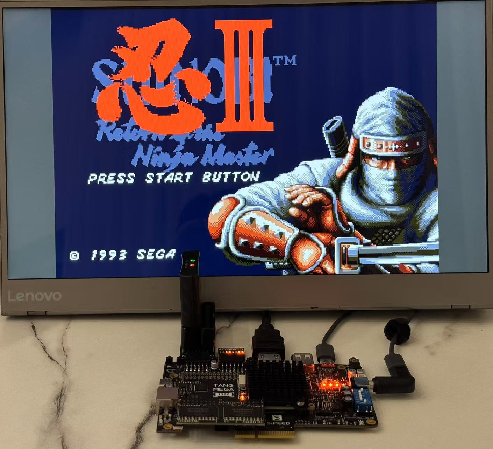

# MDTang - MegaDrive/Genesis for Sipeed Tang FPGA boards

This is a port of the [Genesis-MiSTer](https://github.com/MiSTer-devel/Genesis_MiSTer) core to Sipeed FPGA boards including Tang Mega 60K, 138K and 138K Pro.

This is a mostly verbatim port. So game compatibility should be good. However, many features are not activated yet, such as country settings (set to Americas/NTSC), audio filters and SRAM saves. These features will be enabled over time.

MDTang is part of [TangCore](https://github.com/nand2mario/tangcore), along with  [NESTang](https://github.com/nand2mario/nestang), [SNESTang](https://github.com/nand2mario/snestang) and [GBATang](https://github.com/nand2mario/gbatang).

## Instructions

To install MDTang, follow the [TangCore](https://github.com/nand2mario/tangcore) installation instructions**.

## Documentation

* [Blast Processing on the Tang FPGA boards](https://nand2mario.github.io/posts/2024/mdtang/)

## Acknowledgements
* [Genesis-MiSTer core](https://github.com/MiSTer-devel/Genesis_MiSTer)
